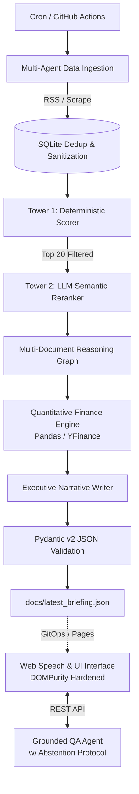

# 🧠 J.A.R.V.I.S. - Evidence-Grounded AI Intelligence Platform


> **Elevator Pitch:** An evidence-grounded AI intelligence pipeline that aggregates multi-domain data, ranks content via a two-tower deterministic/LLM architecture, extracts cross-document knowledge graphs, and serves an interactive web UI backed by strict evidence validation and abstention protocols.

---

## 🏗️ System Architecture

J.A.R.V.I.S. implements a **Hybrid Architecture**, separating deterministic computation (Information Retrieval, Quantitative Math, Confidence Validation) from probabilistic reasoning (Semantic Reranking, Narrative Synthesis).



## 🚀 Core Engineering Features

### 1. Two-Tower Information Retrieval (Scoring + Reranking)
Eliminates LLM context bloat and rate limits by filtering mathematically before invoking cloud models.

- **Tower 1 (Deterministic Filter):** Evaluates time decay (*Freshness*) and source authority weights, pruning raw feeds down to the Top 20 candidates.
- **Tower 2 (Semantic Reranker):** An LLM-as-a-Judge scores macro-technological impact on the filtered subset, outputting structured scores.

### 2. Multi-Document Knowledge Reasoning
Extracts 1-to-N relationships (Edges) between distinct articles (Nodes) to identify macro-trends across disparate domains (e.g., Geopolitics → Semiconductor supply chains).

- **Hallucination Defense:** Implements strict dynamic programmatic validation to ensure all referenced `item_ids` exist in the active state database before persisting the graph.

### 3. Evidence-Grounded Q&A with Abstention
The interactive RAG system does not rely on calibrated probabilities or LLM self-assessment for confidence.

- **Heuristic Confidence:** Extracts an evidence quote and mathematically verifies it against the raw scraped text using exact substring alignment algorithms (`difflib.SequenceMatcher`).
- **Abstention Protocol:** If the heuristic confidence drops below 60.0% (indicating LLM paraphrasing or unsupported facts), the agent refuses to answer ("Insufficient evidence to provide a reliable answer").

### 4. Deterministic Quantitative Layer
Financial metrics (daily return, annualized historical volatility, regime labels) are computed strictly via Pandas and injected as static strings into the LLM context, preventing generative arithmetic errors.

## 📊 Evaluation & Benchmarking

Evaluated offline on a curated 120-item relevance benchmark containing multi-domain events, hard negatives, and freshness decay. To ensure strict reproducibility, benchmarking utilizes a fixed `REFERENCE_TIME` parameter to calculate deterministic temporal decay independently of the live production clock.

| System | NDCG@3 | NDCG@5 | P@3 | P@5 | R@5 |
| :--- | :--- | :--- | :--- | :--- | :--- |
| **Baseline 0 (Input Order)**  | 0.9267 | 0.9400 | 1.0000 | 1.0000 | 0.0833 |
| **Baseline 1 (Deterministic Only)** | 0.9719 | 0.9764 | 1.0000 | 1.0000 | 0.0833 |
| **Current (Deterministic + LLM)** Current_LLM  | 1.0000 | 0.9851 | 1.0000 | 1.0000 | 0.0833 |

*Note: Metrics prove the viability of the hybrid architecture. Baseline 1 (Python math) effectively filters noise to surface highly relevant items (P=1.0), while the LLM Semantic Reranker optimizes the absolute Top-3 ordering without reading 120 documents.*

## 🛡️ Security & Reliability

- **XSS Mitigation:** The frontend is hardened with DOMPurify, sanitizing all dynamic HTML generated by untrusted RSS feeds and LLM outputs before DOM insertion. Static fallbacks utilize the safe `textContent` API.
- **Prompt Injection Defense:** External scraped text is treated as untrusted data and wrapped in explicit `[UNTRUSTED_WEB_CONTEXT]` boundary blocks within system prompts.
- **Fail-Fast CI/CD:** The automated GitHub Actions production pipeline enforces a strict sequence: Dependency Install → `ruff` Linter → `pytest` (Unit & Security tests) → `eval_smoke.py` (Math checks). The system only invokes expensive LLM APIs and triggers deployment if all checks pass.

## 💻 Quick Start

### 1. Installation

```bash
git clone https://github.com/mpozz28/jarvis-daily-briefing.git
cd jarvis-daily-briefing
python -m venv venv
source venv/bin/activate  # On Windows: venv\Scripts\activate
pip install -r requirements.txt
```

### 2. Execution Commands

```bash
# Execute batch ingestion, ranking, reasoning, and JSON export:
python -m src.orchestrator

# Run offline ranking evaluation against the golden dataset:
python -m src.evaluation.eval_ranking

# Start real-time grounded Q&A API server:
python api_server.py
```

## 📘 Engineering Decisions & Limitations

**ADRs:** Deep-dives into architectural trade-offs (Why LangGraph, Why SQLite, Why DOMPurify, Why Heuristic Confidence) are documented in `docs/architecture-decisions.md`.

**Known Limitations:**

- **Evaluation:** The current benchmark utilizes a static offline dataset; a true enterprise system would incorporate asynchronous Human-in-the-Loop continuous evaluation.
- **Graph Persistence:** Multi-document relationships are ephemeral per-run; historical queries would require migrating from SQLite to a persistent Graph/Vector DB (e.g., Neo4j).
- **Web Scraping:** The current ingestion layer (BeautifulSoup) is vulnerable to anti-bot measures on JS-heavy or Cloudflare-protected SPA domains.
