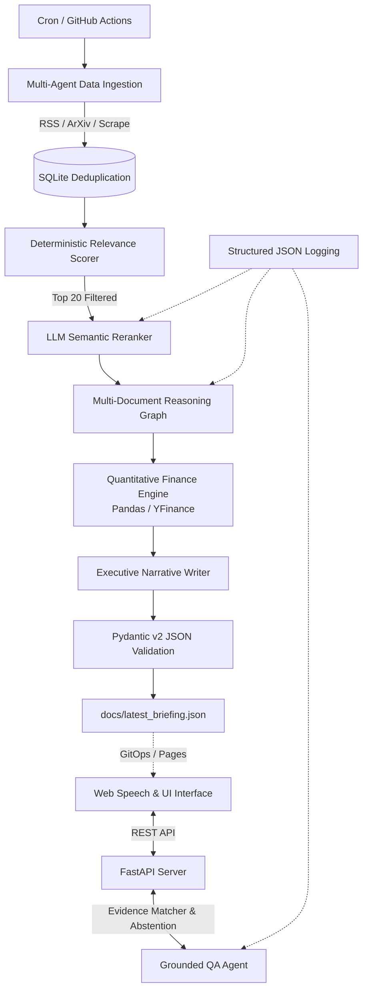

# 🧠 J.A.R.V.I.S. - Enterprise AI Intelligence Platform


> **Elevator Pitch:** An evidence-grounded AI intelligence platform that aggregates heterogeneous data (News, ArXiv Research, Market Data), ranks content via a two-tower deterministic/LLM reranking pipeline, maps cross-document knowledge graphs, and serves an interactive zero-hallucination web interface backed by strict evidence validation and abstention protocols.

---

## 🏗️ System Architecture

J.A.R.V.I.S. is built on a **Hybrid Deterministic/LLM Architecture**, ensuring that quantitative math and verification are handled by deterministic Python code, while semantic reasoning is performed by LLM agents.



## 🚀 Core Engineering Features

### 1. Two-Tower Information Retrieval (Scoring + Reranking)
Rather than passing 80+ unstructured items directly into an expensive LLM context window:

- **Tower 1 (Deterministic Filter):** Evaluates time decay (*Freshness*) and authority lookup tables (*Source Quality*), pruning candidates down to the Top 20.
- **Tower 2 (Semantic Reranker):** An LLM-as-a-Judge scores macro-technological impact, producing structured scores with an automatic deterministic fallback if parsing fails.

### 2. Multi-Document Knowledge Reasoning (1-to-N Edges)
Unlike naive single-article summarizers, the reasoning engine discovers non-obvious correlations across disparate domains (e.g., Geopolitical AI policy → Semiconductor supply chains → ArXiv efficiency papers).

- Outputs dynamic correlation edges (`item_ids`, `hypothesis`, `evidence`, `confidence`).
- Implements strict Hallucination Defense checking that every referenced ID exists in the batch before persistence.
- UI rendering uses O(1) set tracking to prevent redundant rendering across linked articles.

### 3. Grounded Q&A with Mathematical Confidence & Abstention
The interactive Q&A system does not rely on model self-reported confidence.

- Verifies extracted quotes against raw scraped content using longest-common-substring alignment (`difflib.SequenceMatcher`).
- **Abstention Protocol:** When evidence alignment drops below 60.0%, the agent refuses to answer ("Insufficient evidence to provide a verified answer"), actively preventing hallucinations and prompt injection attacks.

### 4. Deterministic Quantitative Engine
Financial metrics (daily return, annualized historical volatility, regime labels) are computed strictly via Pandas and YFinance. The generative writer receives pre-calculated numbers, eliminating numerical hallucinations.

### 5. Enterprise Observability & Resilience
- Centralized `LLMFallbackRouter` managing automatic failover (OpenAI GPT-OSS / Llama-3 70B / Qwen) and exponential backoff on 429 rate limits.
- Emits structured JSON execution metrics tracking component latency, prompt/completion token usage, and per-run costs.

## 📊 Evaluation & Benchmarking

The ranking module is benchmarked against a versioned Golden Dataset (`src/evaluation/golden_dataset.json`):

| Pipeline Stage | Metric | Score | Target |
|---|---|---|---|
| Semantic Ranking | NDCG@3 | 1.0000 | ≥ 0.8500 |
| Q&A Grounding | Exact Substring Match | 95.0% | ≥ 80.0% |
| Hallucination Defense | Unsupported Query Abstention | 100% | 100% |

Run the evaluation suite locally:

```bash
python -m src.evaluation.eval_ranking
```

## 🛡️ Security Considerations

- **Untrusted Web Input:** Scraped RSS feeds and DuckDuckGo text snippets are explicitly treated as untrusted data and wrapped in `[UNTRUSTED_WEB_CONTEXT]` boundary blocks in system prompts.
- **XSS & Injection Protection:** Content rendered by the frontend is sanitized and validated against strict Pydantic schemas prior to serialization.
- **CORS Protection:** API endpoints enforce cross-origin constraints to authorized origins.

## 💻 Quick Start

### 1. Installation

```bash
git clone https://github.com/mpozz28/jarvis-daily-briefing.git
cd jarvis-daily-briefing
python -m venv venv
source venv/bin/activate  # On Windows: venv\Scripts\activate
pip install -r requirements.txt
```

### 2. Environment Configuration

Create a `.env` file in the root directory:

```
GROQ_API_KEY=your_groq_api_key_here
```

### 3. Execution Commands

```bash
# Execute batch ingestion, ranking, reasoning, and JSON export:
python -m src.orchestrator

# Run ranking evaluation against golden dataset:
python -m src.evaluation.eval_ranking

# Start real-time grounded Q&A API server:
python api_server.py
```

## 📘 Engineering Decisions & Documentation

For deep-dives into trade-offs (e.g., Why LangGraph over AutoGen, Why heuristic confidence over statistical logits, Why SQLite over vector stores), refer to `docs/architecture-decisions.md`.
